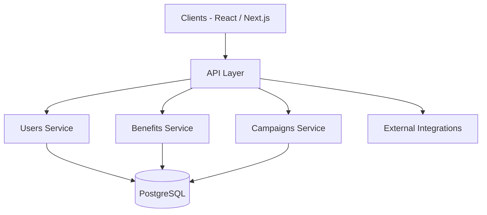

# Architecture Gallery

Selected architecture diagrams across the portfolio. Each entry includes the project, architecture type, key technologies and the main architectural challenge.

## Diagrams

| # | Project | Architecture type | Key technologies | Main challenge |
|---|---|---|---|---|
| 1 | MerchantMiles | Microservices (Loyalty, Fintech/Banking) | React, Next.js, .NET Core 8, PostgreSQL, AWS | Multi-country, multi-tenant scaling and independent deployment |
| 2 | Reference Microservices | Service-oriented (generic reference) | API Gateway, services, PostgreSQL | [diagrams/microservices.svg](microservices.svg) |
| 3 | AI / MCP | AI architecture | Bedrock, embeddings, MCP, n8n, Ollama | Provider abstraction and deterministic automation |
| 4 | Chaide | Modular e-commerce | Next.js, Golang | Catalog/orders/payments paths under demand peaks |
| 5 | GreenCloud | Multi-tenant SaaS | PostgreSQL, SaaS platform | Tenant isolation and reporting accuracy |
| 6 | NeutralBank | Multi-tenant SaaS (banking) | PostgreSQL, SaaS platform | Sensitive portfolio data and auditable reporting |
| 7 | Neutralfy | SaaS + payments | PostgreSQL, payments | Deterministic emissions math and idempotent payments |

## Available diagram files

- [Microservices (SVG)](microservices.svg)

> Additional diagrams are `[in progress]`. Architecture for every project is described inline in its case study using ASCII or Mermaid where appropriate.

## Reference: MerchantMiles architecture (Mermaid)

