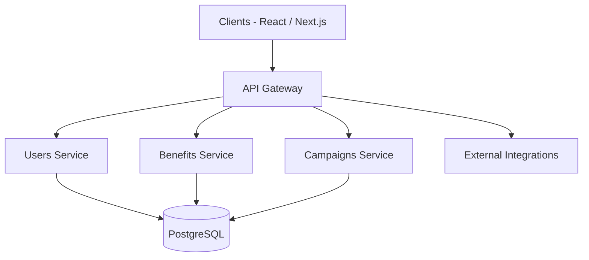
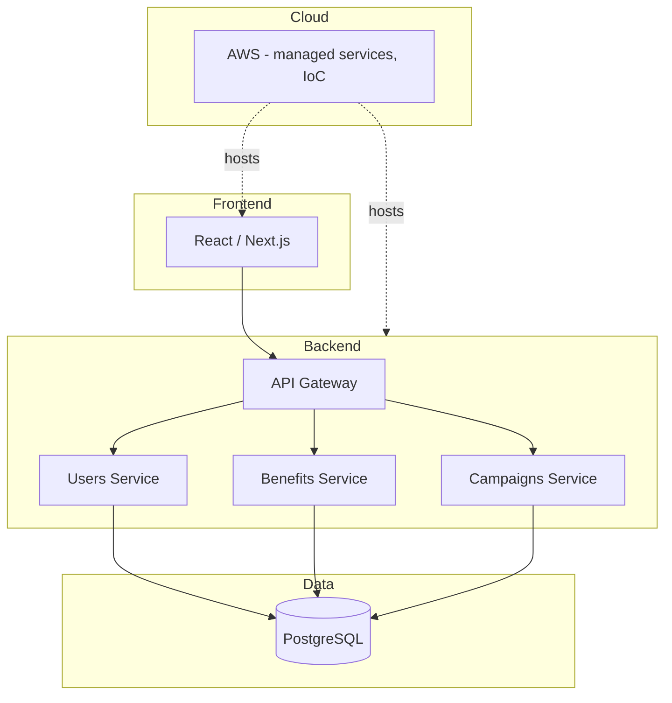

# MerchantMiles — Loyalty Platform (Fintech / Banking)

## Executive Summary

MerchantMiles is a **multi-country loyalty platform** that connects financial-card users with merchants, promotions and benefits. It is **in production** with the private banking divisions of **Clubmiles** and **Promerica**, across **Ecuador and Central America**.

For the private banking client it works as a benefits ecosystem that encourages card usage; for merchants it is a channel to launch campaigns and benefits; for platform administrators it provides tools to manage merchants, branches, users, benefits, campaigns, catalogues, data processing and reporting.

> This product is live in production. Proprietary source code, credentials, private endpoints and confidential customer information are intentionally excluded.

## Business Context

- **Who:** private banking clients, merchants and platform administrators.
- **What:** a loyalty and benefits ecosystem linking banks, merchants and cardholders.
- **Why:** banks need private clients to perceive value beyond payments; merchants need access to a qualified premium audience.
- **Where:** Ecuador and Central America, with the private banking divisions of **Clubmiles** and **Promerica**.

## Business Problem

Banks need their private-banking clients to perceive real value from their cards beyond payments. Without a structured benefits ecosystem, banks cannot easily connect their clients with relevant merchants and offers, and merchants cannot reach a qualified premium audience.

**Problem:** How to deliver a scalable loyalty ecosystem that lets banks run benefits and campaigns for private clients — across multiple countries — while keeping the platform reliable, secure and operationally manageable.

## Constraints

### Business

- Serve multiple countries and banking clients from one platform.
- Support campaign and benefit peaks without degrading the experience.
- Keep business capabilities (users, benefits, campaigns, merchants) independently owned.

### Technical

- Distributed system with explicit API contracts and independent service scaling.
- PostgreSQL as the transactional data platform.
- Frontend and backend coordinated but independently deployable.

### Security

- Protection of private-banking data.
- Authentication and authorization enforced at application boundary and service layer.

### Integration

- Multiple external financial/commerce integrations must be isolated.
- Integrations require timeouts, retries where safe, circuit breakers and idempotency.

### Deployment

- Coordinated backend/frontend releases with CI/CD.
- Reproducible environments via Infrastructure as Code.

### Operational

- Structured logs, metrics, health checks and trace correlation to diagnose failures.
- Availability treated as an architectural concern. No availability percentage is claimed without validated public evidence.

## My Role

**Primary descriptor:** Technical Lead / Solution Architecture

### Leadership

- Technical leadership of the digital product
- Solution design and technical decision making
- Backend/frontend coordination
- Code quality and CI/CD/deployment coordination

### Architecture

- Solution and frontend architecture (React, Next.js, TypeScript)
- Backend architecture (microservices, .NET Core 8)
- Cloud architecture (AWS) and Infrastructure as Code

### Engineering / Frontend

- Frontend development and UI/UX implementation
- API integration and server/client rendering decisions
- Quality, observability and delivery support

## Architecture

```text
                         ┌─────────────────────┐
                         │      Clients        │
                         │ React / Next.js     │
                         └──────────┬──────────┘
                                    │
                                    ▼
                         ┌─────────────────────┐
                         │     API Gateway     │
                         └──────────┬──────────┘
                ┌───────────────────┼───────────────────┐
                │                   │                   │
                ▼                   ▼                   ▼
          ┌──────────┐        ┌──────────┐        ┌──────────┐
          │  Users   │        │ Benefits │        │Campaigns │
          │ Service  │        │ Service  │        │ Service  │
          └────┬─────┘        └────┬─────┘        └────┬─────┘
               │                   │                   │
               └───────────────────┼───────────────────┘
                                   ▼
                              PostgreSQL

                    AWS / Docker / CI-CD / IaC
```

> Diagram component validated with the project owner: the generic "API Layer" is an **API Gateway**.

### Diagram: Context



### Diagram: Container



## Technology

- React, Next.js, TypeScript, TailwindCSS / component libraries
- .NET Core 8, REST APIs, microservices, API Gateway
- PostgreSQL
- AWS (object storage, CDN, IAM, serverless where appropriate), Docker
- Infrastructure as Code, CI/CD

## Integrations

- Financial/commerce integrations, isolated behind contracts.
- See [Reliability →](reliability.md) for failure handling of integrations.

## Security

Authentication and authorization are enforced at the application boundary and service layer. Private-banking data is protected by design.

## Availability & Reliability

- Availability treated as an architectural concern with explicit failure-domain analysis.
- No SLA or uptime percentage is claimed without validated public evidence.

[Reliability document →](reliability.md)

## Diagrams

- [Context →](diagrams/context.md)
- [Containers →](diagrams/container.md)
- [Deployment →](diagrams/deployment.md)

## Scalability

Services can scale independently according to business demand; campaign peaks are the business-critical pattern.

## Observability

Structured logs, metrics, health checks and trace correlation are required to diagnose distributed failures.

## Architecture Decisions

### Why microservices?

**Context:** Multiple business capabilities (users, benefits, campaigns, merchants, reporting) with different scaling and ownership requirements across countries.

**Options:**
1. Monolith
2. Modular monolith
3. Microservices

**Decision:** Services around meaningful business capabilities (microservices), because independent ownership, deployment and scaling were required for a multi-country product.

**Rationale:** The platform spans several banks and countries; capabilities evolve at different rates and must scale independently.

**Trade-offs:**
- *Benefits:* independent deployment/scaling, clear ownership, reduced coupling.
- *Costs:* distributed-system complexity, network failures, operational and observability overhead.

## Trade-offs

- **Microservices vs Monolith:** chosen microservices for independent scaling and ownership; accepted operational complexity.
- **Managed services vs self-managed infrastructure:** preferred AWS managed services to reduce operational burden; kept Infrastructure as Code for reproducibility.
- **Server/client rendering:** chosen per use case — SEO/initial-load paths server-rendered, interactive admin panels client-rendered.
- **Relational database as primary store:** PostgreSQL for transactional consistency; SQL/migrations maturity over NoSQL.

## Challenges

| Area | Challenge | Outcome |
|---|---|---|
| Scalability | Demand peaks around campaigns require services to scale independently | Microservices design with independent scaling |
| Security | Authentication/authorization for private-banking data across countries | Enforcement at application boundary and service layer |
| Integration | Multiple external financial/commerce integrations | Isolated integrations with timeouts, retries where safe, circuit breakers, idempotency |
| Observability | Diagnosing failures across distributed services | Structured logs, metrics, health checks, trace correlation |
| Deployment | Coordinate backend/frontend releases | CI/CD and deployment coordination under technical lead scope |

## Results

### Implementation

- Multi-country loyalty platform with independent microservices, API Gateway, PostgreSQL and an AWS cloud footprint managed with Infrastructure as Code.

### Outcome

- Private banking clients of **Clubmiles** and **Promerica** in **Ecuador and Central America** can discover and redeem merchant benefits through a single production platform.

### Result

> Quantitative impact metrics (users, merchants, campaigns, transactions, availability) are `[Metric to validate]` and are only included once confirmed. See the [metrics inventory →](../../docs/metrics-inventory.md).

## Lessons Learned

- Define business boundaries before defining services.
- Avoid sharing databases indiscriminately.
- Keep external integrations isolated.
- Make asynchronous processing explicit.
- Document important decisions with ADRs.
- Frontend architecture and UI/UX quality are decisive for adoption of client-facing loyalty products.
- Describing a platform accurately matters: "multi-country" is technically precise for this architecture (formal tenant isolation was not documented).

---

## Related

- [Reliability →](reliability.md)
- [PPM Publipromueve experience →](../../experience/ppm.md)
- [Architecture decision: Microservices →](../../docs/architecture-decisions/ADR-001-microservices.md)
- [Architecture decision: PostgreSQL →](../../docs/architecture-decisions/ADR-002-postgresql.md)
- [Architecture decision: AWS →](../../docs/architecture-decisions/ADR-003-aws.md)
- [Metrics inventory →](../../docs/metrics-inventory.md)