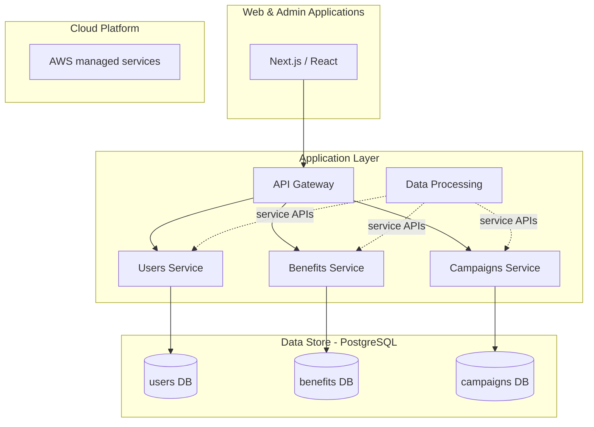

# MerchantMiles — Containers (C4)

## Notes

- Frontend: React, Next.js, TypeScript.
- Backend: .NET Core 8, REST APIs, microservices behind an **API Gateway**.
- Data: **database per service** — each service owns its PostgreSQL database (see [Data Architecture](../data-architecture.md)).
- Reporting/data processing consume service APIs, not shared tables.
- Deployment: AWS, Docker, CI/CD, Infrastructure as Code.
- Details are architectural; proprietary implementation is excluded.