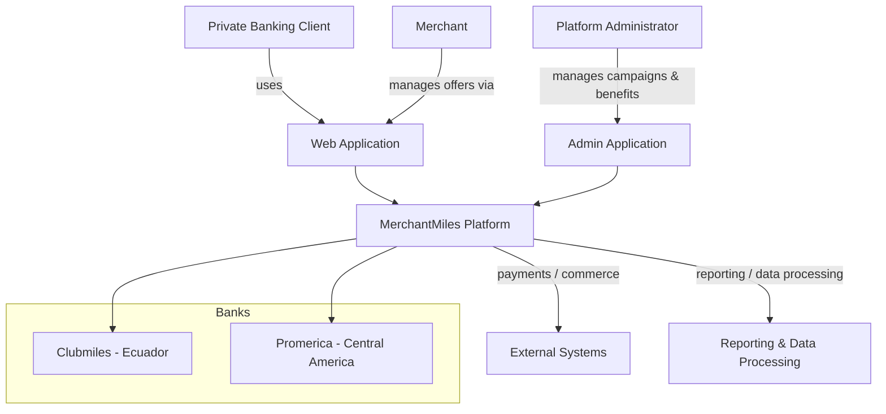

# MerchantMiles — System Context (C4)

## Overview

MerchantMiles is a multi-country loyalty platform in production with the private banking divisions of **Clubmiles** and **Promerica** across **Ecuador and Central America**.

Actors:

- **Private banking clients** — discover and redeem benefits and campaigns.
- **Merchants** — launch and manage offers, campaigns and benefits.
- **Platform administrators** — manage merchants, branches, users, benefits, campaigns, catalogues, data processing and reporting.

External systems: financial/commerce integrations. Confidential details are intentionally excluded.