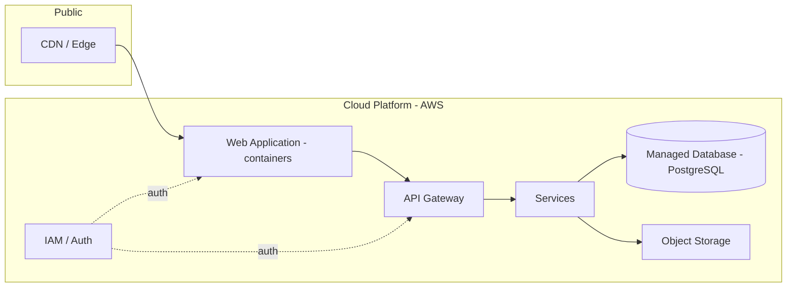

# MerchantMiles — Deployment

Only infrastructure that can be published is shown. Specific account, region and configuration details are intentionally excluded.

## Principles

- Managed services where they reduce operational burden.
- Infrastructure as Code for reproducibility and reviewable change.
- Least-privilege IAM.
- CI/CD with rollback path.
- Backups and monitoring are operational requirements (see [Reliability](../reliability.md)).